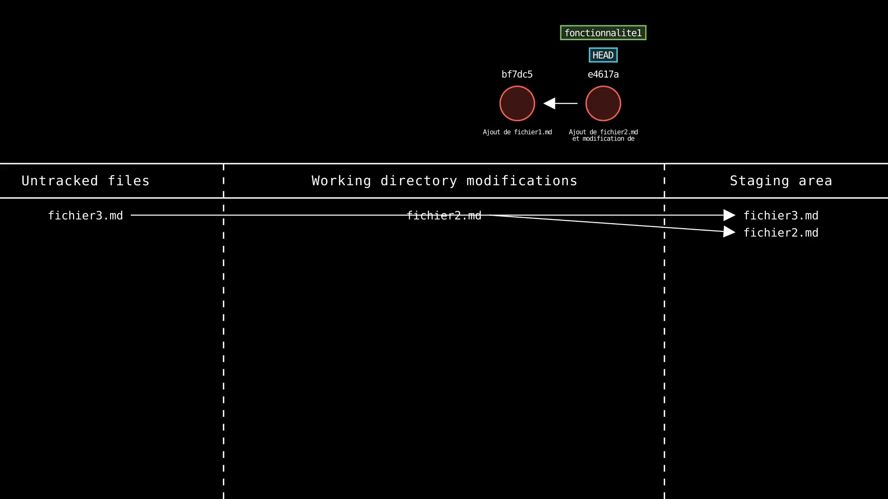
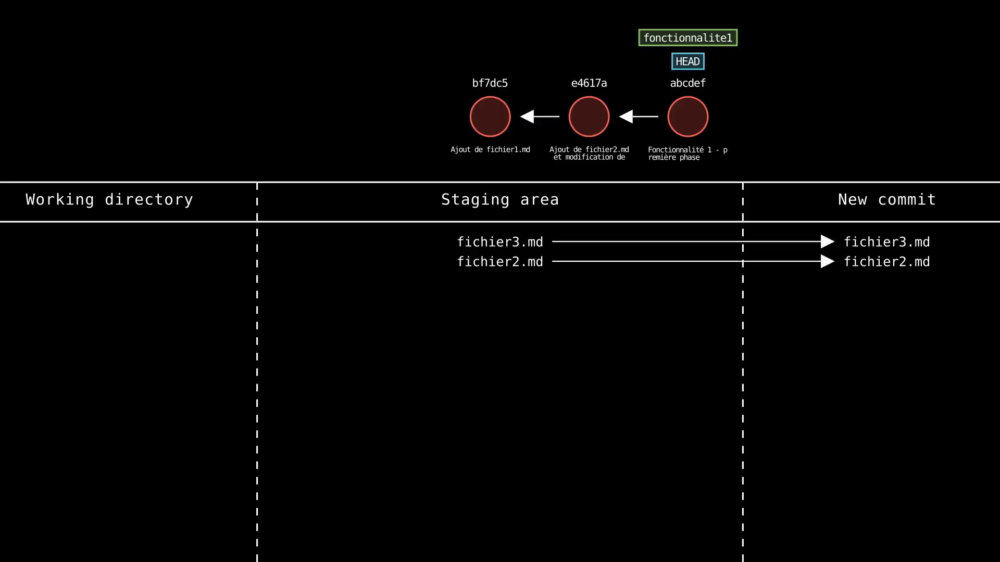
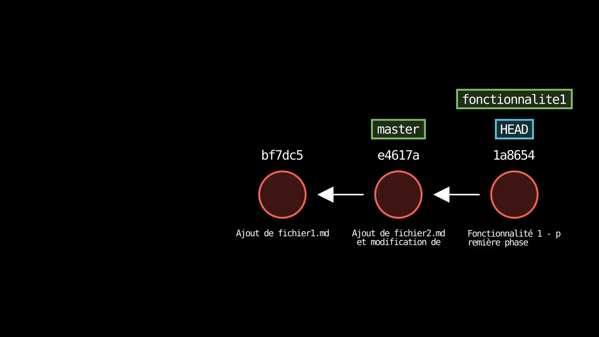
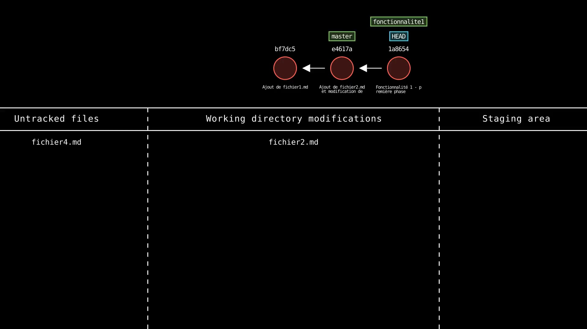
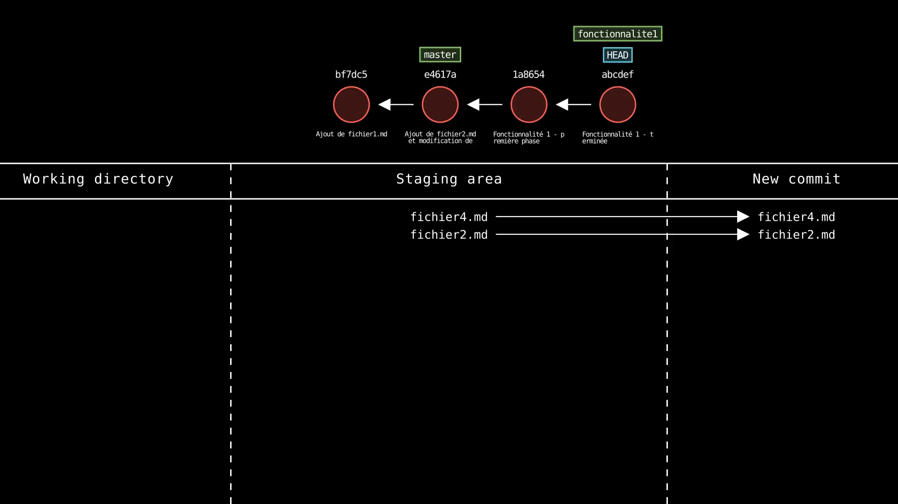
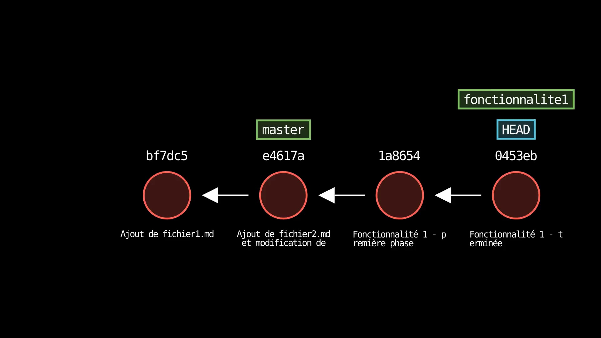
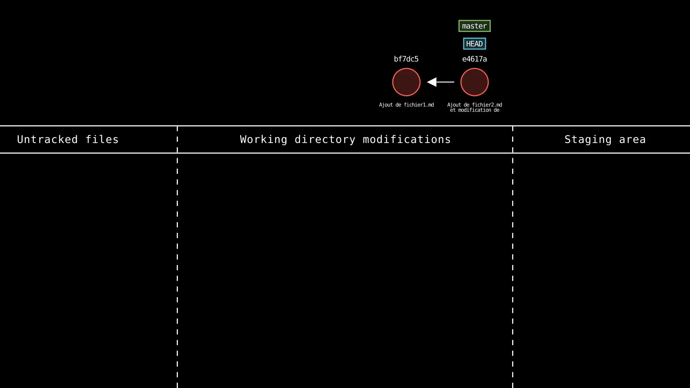
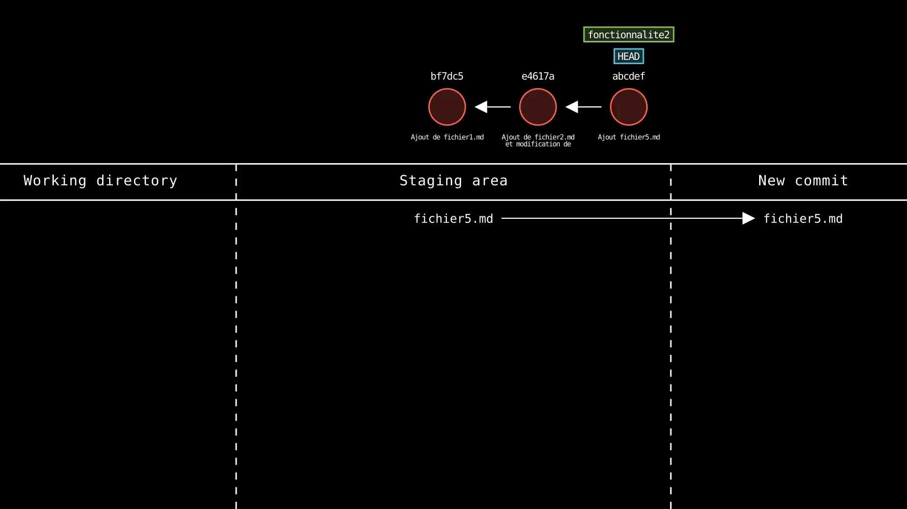

## Partie 2 - Gestion de branches

_Cette partie est à faire sur le même dépôt que la partie précédente. C'est la suite._

- Créer une branche `fonctionnalite1`

```
$ git branch fonctionnalite1
```

> La commande `git branch` permet de créer une nouvelle branche à partir de la branche courante. La branche courante n'est pas modifiée.


- Lister les branches

```
$ git branch
  fonctionnalite1
* master
```

- Se déplacer sur la branche `fonctionnalite1`

```
$ git switch fonctionnalite1
Switched to branch 'fonctionnalite1'
```

> La création d'une branche ne modifie pas la branche courante. Pour se déplacer sur une branche, il faut utiliser la commande `git switch`. Alternative plus ancienne que vous retrouverez souvent : `git checkout fonctionnalite1`.

- Lister les branches

```
$ git branch
* fonctionnalite1
  master
```

- Que représente l'étoile à côté des noms des branches ?

> On peut constater, au vue de ces deux exécutions de `git branch`, que l'étoile indique la branche courante.

- Créer un nouveau fichier `fichier3.md`

```
$ touch fichier3.md
```

> La commande `touch` permet de créer un fichier vide (shell Bash).

- Modifier le fichier `fichier2.md`

```
echo "Modification du fichier2.md" >> fichier2.md
```

- Comment utiliser VS Code pour qu'il nous montre les différences entre l'ancienne version de `fichier2.md` et la version courante que l'on vient d'éditer ?

> Il faut cliquer sur le bouton « Source Control » sur la gauche (`Ctrl+Shift+G`). La liste intitulée _Changes_ nous montre à tout moment tous les fichiers traqués qui ont été modifiés depuis le dernier _commit_. Cela permet de visualiser rapidement le travail en cours par rapport à ce qui est « sauvegardé » dans Git. Pour voir les différences entre la version committée et la version courante, il suffit de cliquer sur le fichier en question. Les différences sont alors affichées dans la fenêtre de droite, dans ce qu'on appelle la vue _diff_.

<br>


<br>

- Committer ces deux modifications : "Fonctionnalité 1 - première phase" (n'oubliez pas d'ajouter à l'index auparavant)

```
$ git add .
```

> On utilise ici le raccourci car on sait que l'ensemble des ajouts et modifications doivent être committés. Si on avait voulu être plus précis, on aurait pu utiliser `git add fichier2.md fichier3.md`.



```
$ git commit -m "Fonctionnalité 1 - première phase"
[fonctionnalite1 1a86545] Fonctionnalité 1 - première phase
 2 files changed, 1 insertion(+)
 create mode 100644 fichier3.md
```



> Voici l'historique des _commits_ à ce stade :



> On voit bien que la branche `master` est restée sur le _commit_ précédent : le nouveau _commit_ a été fait sur la branche `fonctionnalite1`, qui a avancé d'un cran.

- Créer un nouveau fichier `fichier4.md`

```
$ echo "Du contenu pour fichier4.md" > fichier4.md
```

- Modifier de nouveau le fichier `fichier2.md`

```
$ echo "Nouvelle modification du fichier2.md" >> fichier2.md
```

- Committer ces deux modifications : "Fonctionnalité 1 - terminée" (n'oubliez pas d'ajouter à l'index auparavant)

```
$ git status
On branch fonctionnalite1
Changes not staged for commit:
  (use "git add <file>..." to update what will be committed)
  (use "git restore <file>..." to discard changes in working directory)
        modified:   fichier2.md

Untracked files:
  (use "git add <file>..." to include in what will be committed)
        fichier4.md

no changes added to commit (use "git add" and/or "git commit -a")
```



```
$ git add .
```


```
$ git commit -m "Fonctionnalité 1 - terminée"
[fonctionnalite1 0453ebf] Fonctionnalité 1 - terminée
 2 files changed, 2 insertions(+)
 create mode 100644 fichier4.md
```





- Afficher la liste des fichiers du répertoire

```
$ ls
fichier1.md  fichier2.md  fichier3.md  fichier4.md
```

> On voit bien nos quatre fichiers.

- Se déplacer sur la branche `master`

```
$ git switch master
Switched to branch 'master'
```



> _HEAD_ pointe maintenant sur `master`, qui n'a aucune connaissance des deux _commits_ qui ont été faits sur `fonctionnalite1`.

- Afficher la liste des fichiers du répertoire

```
$ ls
fichier1.md  fichier2.md
```

> Seuls les deux fichiers de la branche `master` sont présents.

- Pourquoi les deux sorties sont-elles différentes ? Les fichiers ont-ils disparus ?

> Non, ils sont toujours là. À chaque fois que l'on change de branche, le répertoire de travail est mis à jour pour refléter l'état de la branche sur laquelle on se trouve. C'est ce qu'on appelle le _working tree_. Les fichiers `fichier3.md` et `fichier4.md` sont toujours présents dans Git, mais ils ne sont pas dans la branche `master` : Git les a donc retirés du répertoire de travail.

- Créer une nouvelle branche `fonctionnalite2`

```
$ git branch fonctionnalite2
```

> _HEAD_ pointe sur `master`, donc cette nouvelle branche sera basée sur `master`. Comme `master` n'a pas bougé depuis, la branche `fonctionnalite2` a la même base que `fonctionnalite1`.


- Cette branche ne va pas avoir toutes les données incluses dans `fonctionnalite1`. Pourquoi ?

> Bien qu'étant toutes deux basées sur le même _commit_, `fonctionnalite1` et `fonctionnalite2` sont deux branches indépendantes. Chaque branche a son propre historique de _commits_. `fonctionnalite2` n'a pas accès aux _commits_ qui ont été faits sur `fonctionnalite1`.

- Qu'aurait-il fallu faire si on avait souhaité démarrer la branche `fonctionnalite2` en intégrant les modifications récentes de `fonctionnalite1` ?

> Il aurait fallu baser `fonctionnalite2` sur `fonctionnalite1`, en s'assurant d'être sur la branche `fonctionnalite1` au moment de la création de `fonctionnalite2`.

- Se déplacer sur la nouvelle branche `fonctionnalite2`

```
$ git switch fonctionnalite2
Switched to branch 'fonctionnalite2'
```

- Créer un nouveau fichier `fichier5.md`

```
$ echo "Fichier 5" > fichier5.md
```

- Faire un _commit_ intégrant cette ajout : "Ajout fichier5.md" (n'oubliez pas d'ajouter à l'index auparavant)

```
$ git add fichier5.md
```


```
$ git commit -m "Ajout fichier5.md"
[fonctionnalite2 888c878] Ajout fichier5.md
 1 file changed, 1 insertion(+)
 create mode 100644 fichier5.md
```



- Entrer la commande `git log --oneline --decorate --graph --all` pour visualiser, sur le terminal, le graphe des _commits_ sur toutes les branches

```
$ git log --oneline --decorate --graph --all
* 888c878 (HEAD -> fonctionnalite2) Ajout fichier5.md
| * 0453ebf (fonctionnalite1) Fonctionnalité 1 - terminée
| * 1a86545 Fonctionnalité 1 - première phase
|/
* e4617ae (master) Ajout de fichier2.md et modification de fichier1.md
* bf7dc53 Ajout de fichier1.md
```

- Noter la « déviation » entre les deux branches, à partir de la branche `master` (schématisée sous forme de traits)

> Les deux branches sont en effet basée sur le même _commit_ (`e4617ae`), sur lequel pointe encore pour l'instant la branche `master`. L'historique part du bas vers le haute, comme pour un `git log` classique. Les étoiles représentent ici des _commits_, et les barres verticales l'évolution des branches. On voit que `fonctionnalite2` a 1 _commit_ de plus que `master` tandis que `fonctionnalite1` a 2 _commits_ de plus (mais pas les mêmes).

- l'option `--all` permet de visualiser toutes les branches, pas seulement celle sur laquelle on est
- l'option `--oneline` affiche les _commits_ sur une seule ligne
- l'option `--graph` affiche le log sous forme de graphe
- (utilisez si besoin les touches haut/bas pour naviguer dans la sortie de cette commande et `Q` pour quitter)

- Installer l'extension VS Code _Git Graph_ et visualiser le graphe actuel des _commits_ à l'aide de cette extension

> Il faut utiliser la palette de commande (Ctrl+Shift+P) et trouver la commande `Git Graph: View Git Graph` pour ouvrir l'onglet _Git Graph_.

<br>


<br>

- Sur cette représentation, que représente les points ?

> Ce sont des _commits_.

- Comment voit-on sur quelle branche on est actuellement ?

> La branche sur laquelle on est actuellement (_HEAD_) est indiquée en gras.
